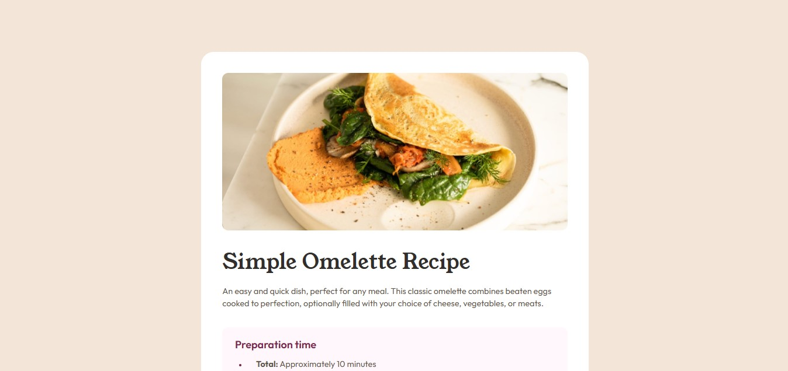

# Frontend Mentor - Solução da Página de Receita (Recipe Page)

Esta é a minha solução para o desafio "Recipe page" do Frontend Mentor. O objetivo do projeto foi construir um card de receita totalmente responsivo, chegando o mais próximo possível do design proposto.

## Visão Geral

### O Desafio

Os usuários devem ser capazes de:
- Visualizar o layout ideal para a interface dependendo do tamanho da tela do seu dispositivo (responsividade completa).

### Captura de Tela



### Links

- **Código no GitHub:** [Visualizar Repositório](https://github.com/mnyellison/recipe-page)
- **Site Online (Live Preview):** [Acessar Projeto](https://recipe-page-six-pearl.vercel.app/)

---

## Meu Processo

### Tecnologias Utilizadas

- HTML5 Semântico
- Variáveis CSS (Custom Properties)
- CSS Grid
- Fluxo de desenvolvimento Mobile-first
- Design Responsivo

---

### O que eu aprendi neste projeto

Este projeto foi excelente para consolidar conceitos fundamentais de estilização e estrutura:

1. **Desenvolvimento Mobile-First:** Pratiquei a construção do layout pensando primeiro em dispositivos móveis e depois adaptando para telas maiores.
2. **Design Tokens com Variáveis CSS:** Organizei o CSS utilizando variáveis baseadas nos guias do Figma do projeto, o que facilita muito a manutenção do código.
3. **Herança de Tipografia:** Aprendi que utilizar valores puramente numéricos (multiplicadores) para a propriedade `line-height` permite uma herança perfeita e segura para os elementos filhos.
4. **Estilização de Listas:** Dominei a customização avançada de marcadores de lista utilizando o pseudo-elemento `::marker`.
5. **Estilização de Tabelas:** Superei os desafios comuns de espaçamento em tabelas HTML combinando `border-collapse: collapse` e aplicando padding diretamente nas células (`td`) para criar linhas divisórias limpas.

Exemplo de variáveis CSS e estrutura de tabela que desenvolvi no projeto:

```css
:root {
  --font-size-xl: 2.5rem;
  --font-size-base: 1rem;
  --spacing-400: 2rem;
}

header p {
  line-height: 1.5; /* Multiplicador puro para herança segura */
}

.nutrition-table {
  width: 100%;
  border-collapse: collapse;
  margin-top: var(--spacing-300);
}

.nutrition-table tr {
  border-bottom: 1px solid var(--color-stone-150);
}

.nutrition-table tr:last-child {
  border-bottom: none;
}

.nutrition-table td {
  padding: var(--spacing-150) var(--spacing-400);
}
```

---

### Próximos passos

Nos próximos projetos, pretendo continuar aprimorando:

- Layouts avançados com Flexbox e alinhamentos complexos.
- Práticas avançadas de responsividade.
- Organização e arquitetura CSS.
- Uso cada vez mais rigoroso do HTML Semântico.

---

### Colaboração com IA (Gemini)

Utilizei o Gemini durante o desenvolvimento deste projeto como um mentor para:

- Compreender a fundo cálculos de `line-height` no CSS.
- Discutir estratégias de layout (ex: decidir entre usar a tag `<hr>` ou bordas para linhas divisórias horizontais).
- Resolver pequenos bugs de modelo de caixa (box-model), como colapso de margens.
- Revisar minhas boas práticas de commits no Git.
- Validar conceitos de fluxo de desenvolvimento Mobile-first.

O uso da IA me ajudou a entender os conceitos por trás das soluções em vez de apenas colar códigos prontos, funcionando como um parceiro de code review.

---

## Autor

- Frontend Mentor - [@mnyellison](https://www.frontendmentor.io/profile/mnyellison)
- GitHub - [@mnyellison](https://github.com/mnyellison)
